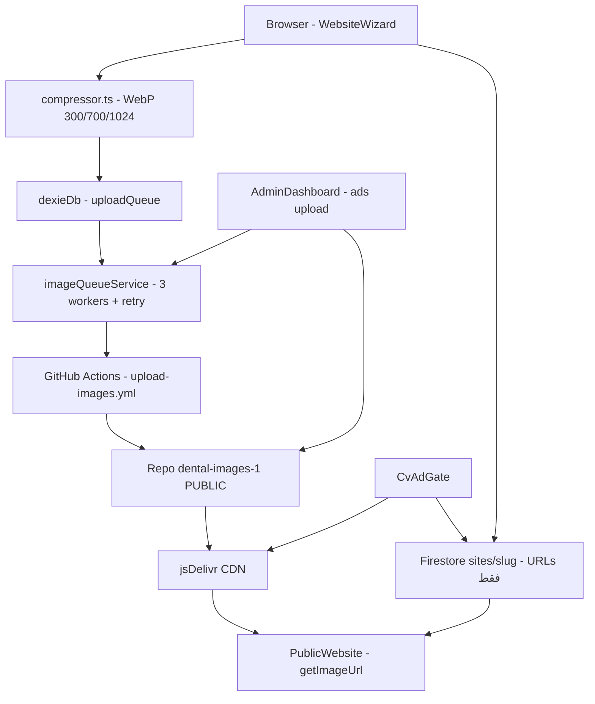

# خطة الترحيل: إلغاء Firebase Storage والانتقال الكامل إلى GitHub + jsDelivr + Firestore URLs

> **الهدف:** حل مشكلة أن Firebase Storage يعمل فقط على الخطة المدفوعة (Blaze) عبر إلغائه تماماً، ونقل كل الصور (حالات، بروفايل، إعلانات) إلى المستودع العام `dental-images-1` مع ضمان عدم تجاوز Firestore حد 1MB للـ document.
> **المشروع المستهدف:** `C:\Users\MICKY\Desktop\vip model`
> **الخطة المرجعية:** [`plans/ENDPOINT.md`](plans/ENDPOINT.md:1)
> **تاريخ الخطة:** 2026-09-28

---

## 0. نتيجة الفحص السريع لمشروع `vip model` مقابل `ENDPOINT.md`

### ما تم تنفيذه فعلاً ✅
- **Phase 0 — التنظيف:** حذف `worker/`, `wrangler.toml`, `migrations/` — لا وجود لها في `vip model`. تنظيف [`package.json`](package.json:1) وإضافة `browser-image-compression`, `dexie`, `konva`, `react-konva`, `vite-plugin-pwa`.
- **Phase 1 — البنية V4:** وجود `.github/workflows/upload-images.yml`, `deploy.yml`, `src/lib/compressor.ts`, `src/lib/cdn.ts`, `src/lib/sharding.ts`, `src/lib/firebase.ts` (HashRouter في [`src/App.tsx`](src/App.tsx:1)).
- **Phase 2 — /website:** [`src/services.ts`](src/services.ts:1) يعرف 4 خدمات، [`src/App.tsx`](src/App.tsx:1) يستخدم `useHashLocation`، [`src/pages/WebsiteWizard.tsx`](src/pages/WebsiteWizard.tsx:1) بـ 6 خطوات + Dexie autosave، [`src/lib/imageQueueService.ts`](src/lib/imageQueueService.ts:1) بـ Queue 3 متوازية + Retry + IndexedDB، [`src/pages/PublicWebsite.tsx`](src/pages/PublicWebsite.tsx:1) موجود، [`src/pages/Dashboard.tsx`](src/pages/Dashboard.tsx:1) و [`src/pages/AdminDashboard.tsx`](src/pages/AdminDashboard.tsx:1) موجودان.
- **Phase 3 — Promo:** [`src/lib/promoService.ts`](src/lib/promoService.ts:1) و [`src/components/PromoGate.tsx`](src/components/PromoGate.tsx:1) موجودان، Admin يدير الأكواد.
- **Phase 4/5 — DSD/Motion:** [`src/pages/DsdStudio.tsx`](src/pages/DsdStudio.tsx:1) و [`src/pages/MotionStudio.tsx`](src/pages/MotionStudio.tsx:1) موجودان (Client-Side فقط).
- **Phase 6 — Chatbot:** [`src/components/ContextAwareChatbot.tsx`](src/components/ContextAwareChatbot.tsx:1) موجود.
- **Phase 7 — جزئي:** [`src/components/CvAdGate.tsx`](src/components/CvAdGate.tsx:1) يقرأ من `settings/global`، `sitemap.xml` و `robots.txt` موجودان.

### ثغرات حرجة تم اكتشافها ⚠️
1. **Firebase Storage لا يزال مُضمّناً:** [`src/lib/firebase.ts`](src/lib/firebase.ts:4) يستورد `getStorage` ويُصدّر `storage`، و [`firebase.json`](firebase.json:5) يحتوي بلوك `storage`، و [`storage.rules`](storage.rules:1) موجود — كلها يجب حذفها لأنها تتطلب Blaze.
2. **تخزين الصور في Firestore كـ base64:** في [`src/pages/WebsiteWizard.tsx`](src/pages/WebsiteWizard.tsx:212) يتم `FileReader.readAsDataURL` ووضع النتيجة مباشرة في `formData.hero.profileImage`، وهذا سيُخزّن base64 داخل `sites.dataJson` ويُفجّر حد 1MB. نفس الخطر في `cases[].image` إذا بقيت blob/preview URLs دون استبدالها بـ CDN URLs قبل النشر.
3. **صور الإعلانات والبروفايل لا تزال تفترض Storage:** `settings/global.cvAdPosterUrl` يُفترض أنه `firebasestorage.googleapis.com/...` — يجب تحويله إلى `cdn.jsdelivr.net/gh/.../ads/...`.
4. **PWA غير مُفعّل فعلياً:** [`vite.config.ts`](vite.config.ts:1) لا يستورد `vite-plugin-pwa` رغم وجوده في `devDependencies`.
5. **لا يوجد حارس لحجم Firestore:** لا يوجد فحص لحجم `dataJson` قبل `setDoc` — خطر `FAILED_PRECONDITION: Document too large`.

---

## 1. البنية الجديدة المقترحة (بدون Storage)



**القاعدة الذهبية:** Firestore يُخزّن **نصوص + URLs فقط** (كل طبيب ~2-5KB). الصور **لا تدخل Firestore أبداً** — تُرفع إلى GitHub وتُعرض عبر jsDelivr.

### هيكل المستودع العام `dental-images-1` (public)
```
/ads/cv-poster-2026-09-28.webp
/ads/promo-banner-xyz.webp
/dr-ahmed/profile-thumb.webp
/dr-ahmed/profile-medium.webp
/dr-ahmed/profile-full.webp
/dr-ahmed/case-1727520000000-0-thumb.webp
/dr-ahmed/case-1727520000000-0-medium.webp
/dr-ahmed/case-1727520000000-0-full.webp
/dr-sara/profile-*.webp
/dr-sara/case-*.webp
```

---

## 2. خطة التنفيذ التفصيلية (Checklist للـ Code Mode)

### Phase A — إزالة Firebase Storage نهائياً
- [x] A1. تعديل [`src/lib/firebase.ts`](src/lib/firebase.ts:1): حذف `import { getStorage }` و `getStorage(app)` و `storage.maxUploadRetryTime` و `export { storage }`. الإبقاء على `app, auth, db, analytics` فقط.
- [x] A2. تعديل [`firebase.json`](firebase.json:1): حذف بلوك `"storage": { "rules": "storage.rules" }` بالكامل.
- [x] A3. حذف ملف [`storage.rules`](storage.rules:1) من المشروع.
- [x] A4. بحث شامل عن أي `import { storage }` أو `from 'firebase/storage'` في `src/` وحذفه (حالياً لا يوجد استخدام فعلي سوى في `firebase.ts`).
- [x] A5. تحديث [`.firebaserc`](.firebaserc:1) و [`firestore.rules`](firestore.rules:1) للتأكد من عدم وجود إشارة لـ Storage.

### Phase B — توسيع نظام GitHub + jsDelivr ليشمل الإعلانات والبروفايل
- [x] B1. تحديث [`.github/workflows/upload-images.yml`](.github/workflows/upload-images.yml:1): إضافة `inputs.folder` اختياري (default `""`) ودعم مسار `ads/` و `slug/` ديناميكياً. تعديل `run` ليُنشئ `mkdir -p "${{ inputs.folder }}/${{ inputs.slug }}"` أو `mkdir -p "ads"` حسب النوع.
- [x] B2. تحديث [`src/lib/cdn.ts`](src/lib/cdn.ts:1): إضافة دوال جديدة:
  - `getAdImageUrl(filename, repo)` → `https://cdn.jsdelivr.net/gh/portfoliohubs/dental-images-1@main/ads/${filename}.webp`
  - `getProfileImageUrl(slug, size)` → `https://cdn.jsdelivr.net/gh/.../${slug}/profile-${size}.webp`
  - `getCaseImageUrl(slug, caseId, size)` → `https://cdn.jsdelivr.net/gh/.../${slug}/${caseId}-${size}.webp`
  - مع `getFallback*` لكل منها.
- [x] B3. تحديث [`src/lib/sharding.ts`](src/lib/sharding.ts:1): التأكد أن `getActiveImageRepo()` يعمل مع المستودع العام (public) بدون PAT للقراءة، ومع PAT للكتابة فقط.
- [x] B4. تحديث [`src/lib/imageQueueService.ts`](src/lib/imageQueueService.ts:1): إضافة `type UploadKind = 'case' | 'profile' | 'ad'` وتمرير `folder` إلى `dispatchUpload`. لـ `ad` يكون `folder="ads"` و `slug=""`.

### Phase C — إصلاح WebsiteWizard لمنع تخزين base64 في Firestore
- [x] C1. تعديل [`src/pages/WebsiteWizard.tsx`](src/pages/WebsiteWizard.tsx:212) دالة `handleProfileImageUpload`: **حذف** `FileReader.readAsDataURL` الذي يضع base64 في `formData`. بدلاً منه: عرض `previewUrl = URL.createObjectURL(file)` مؤقتاً، وإضافة `await imageQueueService.enqueue({ slug, filename: 'profile', file, kind: 'profile' })`، وعند اكتمال الـ queue استبدال `formData.hero.profileImage` بـ `getProfileImageUrl(slug, 'medium')`.
- [x] C2. تعديل `handleCaseImageUpload`: بعد `enqueue`، الاستماع لـ `imageQueueService.subscribe` وتحديث `cases[].image` من `previewUrl` إلى `getCaseImageUrl(slug, caseId, 'medium')` عند `status === 'completed'`.
- [x] C3. تعديل `handlePublish`: قبل `setDoc`، بناء `dataJson` جديد حيث كل `image` هو CDN URL فقط (لا base64 ولا blob). إضافة فحص حجم (انظر Phase E).

### Phase D — ترحيل صور الإعلانات والبروفايل إلى dental-images-1
- [x] D1. تعديل [`src/pages/AdminDashboard.tsx`](src/pages/AdminDashboard.tsx:1) تبويب `settings`: إضافة `<input type="file" accept="image/*">` لرفع صورة إعلان CV. عند الاختيار: `compressImage(file)` → `imageQueueService.enqueue({ slug: '', filename: 'cv-poster', file, kind: 'ad' })` → عند الاكتمال `setGlobalSettings({ cvAdPosterUrl: getAdImageUrl('cv-poster') })` → `setDoc(doc(db, 'settings', 'global'), { cvAdPosterUrl }, { merge: true })`.
- [x] D2. تعديل [`src/components/CvAdGate.tsx`](src/components/CvAdGate.tsx:1): التأكد أنه يقرأ `cvAdPosterUrl` من Firestore ويعرضه مباشرة (هو بالفعل يفعل ذلك في السطر 33). لا حاجة لـ Storage. إضافة fallback إلى `getAdImageUrl` إذا كان الحقل فارغاً.
- [x] D3. ترحيل أي صور إعلانات قديمة من Storage (إن وجدت) إلى `dental-images-1/ads/` يدوياً عبر سكريبت أو رفع مباشر.

### Phase E — حارس حجم Firestore (1MB) + تخزين ذكي
- [x] E1. إنشاء ملف جديد [`src/lib/firestoreSizeGuard.ts`](src/lib/firestoreSizeGuard.ts:1):
  ```ts
  export function estimateFirestoreSize(obj: unknown): number
  export function assertUnderLimit(obj: unknown, limitBytes?: number): void
  export function stripBase64FromDataJson(dataJson: any): any
  ```
  - `estimateFirestoreSize` يحسب `new TextEncoder().encode(JSON.stringify(obj)).length`.
  - `assertUnderLimit` يرمي خطأ واضح إذا تجاوز 900KB (هامش أمان 100KB).
  - `stripBase64FromDataJson` يستبدل أي `data:image/...;base64,` بـ CDN URL أو يحذفه.
- [x] E2. في [`src/pages/WebsiteWizard.tsx`](src/pages/WebsiteWizard.tsx:248) قبل `setDoc(siteRef, ...)`:
  ```ts
  const cleanDataJson = stripBase64FromDataJson({ ...formData, slug });
  assertUnderLimit(cleanDataJson, 900 * 1024);
  ```
  إذا فشل الفحص: عرض رسالة للمستخدم "عدد الحالات كبير جداً — سيتم حفظ الحالات الإضافية في subcollection".
- [x] E3. **آلية Chunking الاحتياطية (اختيارية لكن موصى بها):** إذا كان `cases.length > 20` أو الحجم > 900KB، قسّم الحالات إلى `sites/{slug}/cases/{caseId}` كـ subcollection، واحتفظ في `sites/{slug}.dataJson.cases` بأول 3 حالات فقط + `casesCount` و `casesRef: "subcollection"`. يقرأ [`src/pages/PublicWebsite.tsx`](src/pages/PublicWebsite.tsx:1) من الـ subcollection عند الحاجة.
- [x] E4. تحديث [`firestore.rules`](firestore.rules:1): إضافة قواعد لـ `sites/{slug}/cases/{caseId}`:
  ```
  match /sites/{slug}/cases/{caseId} {
    allow read: if true;
    allow write: if isAdmin() || (request.auth != null && get(/databases/$(database)/documents/sites/$(slug)).data.tenantId == request.auth.uid);
  }
  ```

### Phase F — تحديثات متفرقة وإصلاحات
- [x] F1. تفعيل PWA: تعديل [`vite.config.ts`](vite.config.ts:1) لاستيراد `VitePWA` وإضافة `VitePWA({ registerType: 'autoUpdate', workbox: { runtimeCaching: [{ urlPattern: /^https:\/\/cdn\.jsdelivr\.net\/.*/, handler: 'CacheFirst' }] } })`.
- [x] F2. تحديث [`.env.example`](.env.example:1): حذف `VITE_FIREBASE_STORAGE_BUCKET` إذا كان موجوداً، وتوضيح أن `VITE_GITHUB_PAT` مطلوب فقط للكتابة، وأن القراءة تعمل بدون PAT لأن المستودع public.
- [x] F3. تحديث [`README.md`](README.md:1) و [`ADMIN_MANUAL.md`](ADMIN_MANUAL.md:1) لتوثيق البنية الجديدة بدون Storage.
- [x] F4. تنظيف `node-compile-cache/` من الـ repo (إضافته إلى [`.gitignore`](.gitignore:1) إن لم يكن موجوداً).

### Phase G — اختبار ونشر
- [x] G1. اختبار محلي: رفع بروفايل + 3 حالات + إعلان → التأكد أن Firestore يحتوي URLs فقط وحجمه < 10KB.
- [x] G2. اختبار `PublicWebsite` يعرض الصور عبر jsDelivr مع fallback إلى `raw.githubusercontent`.
- [x] G3. اختبار `CvAdGate` يعرض إعلان من `ads/` بدون Storage.
- [x] G4. اختبار حد 1MB: محاولة نشر 50 حالة → التأكد أن الحارس يمنع أو يُقسّم إلى subcollection.
- [x] G5. نشر نهائي إلى Firebase Hosting (`firebase deploy --only hosting,firestore:rules`) والتأكد من عدم وجود خطأ `storage.rules`.

---

## 3. اعتبارات إضافية

- **الأمان:** بما أن `dental-images-1` سيصبح public، لا تضع فيه بيانات حساسة. الصور العامة (إعلانات، بروفايل، حالات) آمنة للنشر العام. بيانات الطبيب النصية تبقى في Firestore مع قواعد `isOwner` و `isAdmin`.
- **التكلفة:** GitHub public + jsDelivr = bandwidth غير محدود مجاناً. Firestore على الخطة المجانية (Spark) يكفي لـ 200k طبيب إذا كان كل document < 5KB.
- **الترحيل:** لا حاجة لترحيل بيانات قديمة من Storage إذا لم يكن هناك بيانات فعلية. إذا وجدت، يمكن سكريبت بسيط يحمل من Storage ويعيد الرفع إلى GitHub.
- **التوافق:** كل التغييرات تحافظ على واجهة `getImageUrl` الحالية — فقط تُضاف دوال مساعدة جديدة.

---

## 4. الملفات التي سيتم لمسها (لـ Code Mode)

- `src/lib/firebase.ts` — حذف Storage
- `firebase.json` — حذف بلوك storage
- `storage.rules` — حذف
- `.github/workflows/upload-images.yml` — دعم ads/
- `src/lib/cdn.ts` — دوال ads/profile/case
- `src/lib/imageQueueService.ts` — دعم kind/folder
- `src/lib/firestoreSizeGuard.ts` — جديد
- `src/pages/WebsiteWizard.tsx` — إصلاح base64 + حارس الحجم
- `src/pages/AdminDashboard.tsx` — رفع إعلانات إلى GitHub
- `src/components/CvAdGate.tsx` — تأكيد قراءة CDN URL
- `src/pages/PublicWebsite.tsx` — قراءة subcollection إذا لزم
- `firestore.rules` — قواعد subcollection
- `vite.config.ts` — تفعيل PWA
- `.env.example`, `README.md` — توثيق

---

## 5. أسئلة للمالك قبل التنفيذ

1. هل توافق على جعل `dental-images-1` **public** (مطلوب لـ jsDelivr بدون PAT)؟
2. هل تريد الاحتفاظ بـ `storage.rules` كملف فارغ أم حذفه نهائياً؟
3. هل تفضل آلية الـ subcollection للحالات الكثيرة أم الاكتفاء برفض النشر مع رسالة "قلل عدد الحالات"؟

> بعد موافقتك، سيتم طلب `switch_mode` إلى `code` لتنفيذ كل Phases أعلاه بالترتيب.
